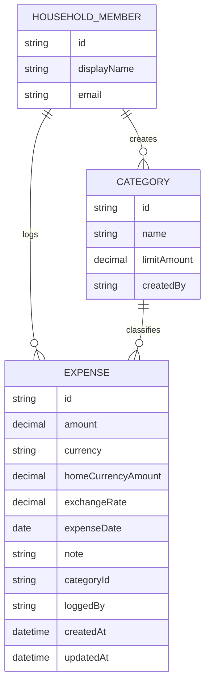

# Domain Model

The household shares one set of expense categories, each with a limit, and expenses that belong to whichever member logged them but are visible to both.

- **HouseholdMember** — resolved from the signed-in identity (Thunder); not a table this service owns, but referenced by `loggedBy`/`createdBy`.
- **Category** — a shared spending group with a `limitAmount`; either member can create, edit, or delete one.
- **Expense** — a single spend entry against a category, editable and deletable by either member regardless of who logged it (`loggedBy`). `currency` is the currency it was paid in; when that differs from the household's home currency (USD), `homeCurrencyAmount` and `exchangeRate` hold the converted amount and the rate used, looked up from ExchangeRate-API for the expense's date. Totals, category spend, and limits are always computed from `homeCurrencyAmount`.

