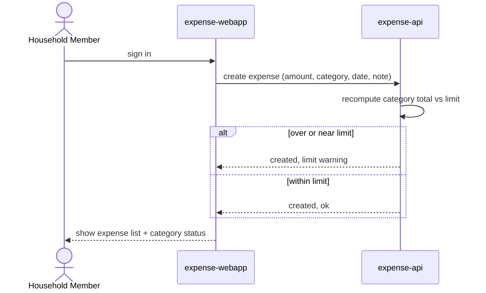

# Log an Expense and See Limit Status

A household member logs an expense and immediately sees whether its category is nearing or over its limit.

```mermaid
sequenceDiagram
    actor Member as Household Member
    participant expense-webapp
    participant expense-api

    Member->>expense-webapp: sign in
    expense-webapp->>expense-api: create expense (amount, category, date, note)
    expense-api->>expense-api: recompute category total vs limit
    alt over or near limit
        expense-api-->>expense-webapp: created, limit warning
    else within limit
        expense-api-->>expense-webapp: created, ok
    end
    expense-webapp-->>Member: show expense list + category status
```

