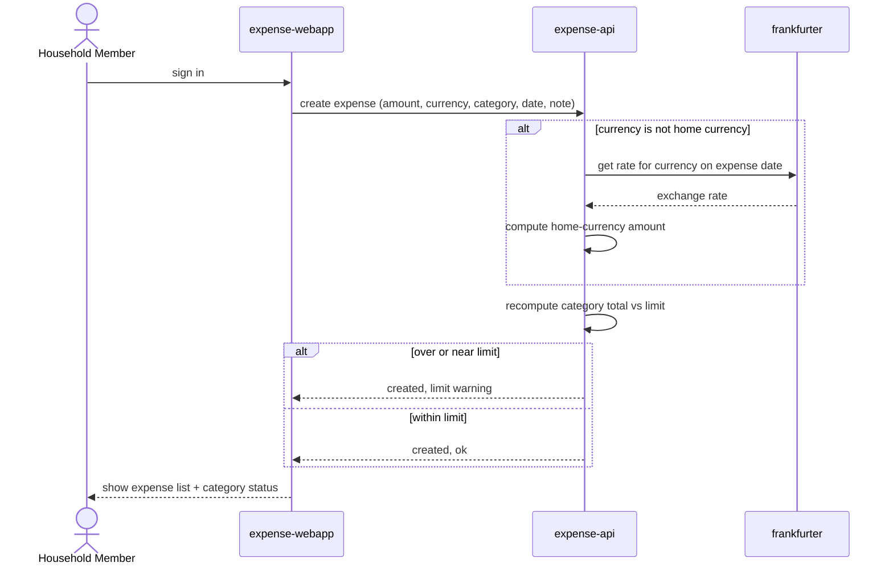

# Log an Expense and See Limit Status

A household member logs an expense, possibly in a foreign currency, and immediately sees the converted amount plus whether its category is nearing or over its limit.

